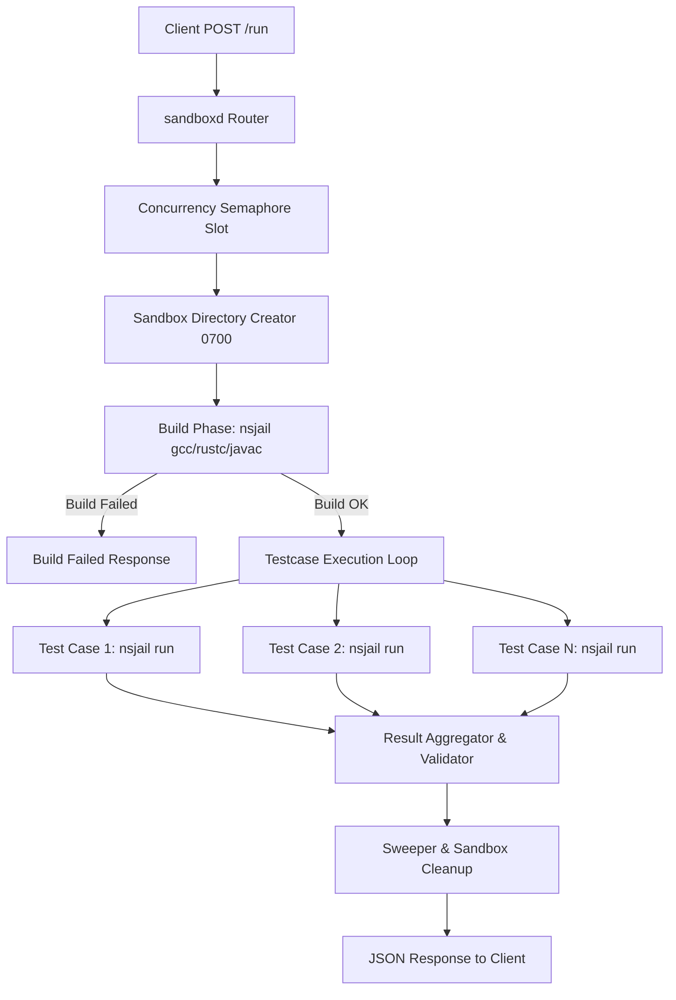

# System Architecture

`sandboxd` is a high-performance, concurrent, and highly secure code sandbox runner built in **Go**. It replaces traditional, slow, and resource-heavy multi-processing supervisors with a modern, asynchronous execution model using Go's lightweight concurrency features.

---

## High-Level Picture

The supervisor runs as an HTTP service. When a request is received, the Go layer handles concurrency scheduling using channel-based semaphores, sets up individual sandbox directories, compiles the program (if required), sequentially executes the test cases inside the sandbox chroot, and aggregates the results before sweeping the sandbox clean.

---

## Architectural Components

### 1. HTTP Layer (`internal/api`)
Exposes REST endpoints built on standard Go concurrency:
- **`router.go` & `handlers.go`**: Directs requests to `/run`, `/info`, `/healthz`, and `/readyz`.
- **`middleware.go`**: Validates request structural schemas, injects request IDs, logs details via slog, recovers from panics, and limits input payload size to 512KB to prevent denial-of-service (DoS) memory exhaustion.

### 2. Concurrency & Scheduling (`internal/runner/runner.go`)
- **Goroutine Semaphore**: Instead of heavy process forks, `sandboxd` caps absolute execution concurrency using a highly optimized buffered Go channel pool (`sem chan struct{}`).
- **In-Flight Metrics**: Tracks active jobs in real-time using atomic counters (`atomic.Int32`) so orchestration environments (like Kubernetes) can query current load via `/info`.

### 3. Execution & Hardened Isolation (`internal/runner/sandbox.go`)
- **Namespace & Jail Lifecycle**: For every job, `sandboxd` creates an isolated directory in `/tmp/sandboxd-jails/` with restricted `0700` privileges.
- **Dynamic Templating**: Translates language execution specifications from configuration files (`lang.yaml`), inserting sandbox-relative paths (e.g. `/solution.c`, `/solution`) and custom runtime/compile flags to prevent jail escapes.
- **Process Telemetry**: Gathers peak resident memory usage (RSS) directly from kernel-level process state telemetry via `syscall.Rusage`.

---

## System Workflows

### Request Execution Lifecycle
For a given compilation/run submission (e.g. C program with 3 test cases):

1. **Scheduling**: The runner blocks on the concurrency semaphore (`r.sem <- struct{}{}`) until a slot is available, respecting the client context timeout.
2. **Setup**: Creates a distinct `/tmp/sandboxd-jails/{request_id}` directory containing a `tmp` folder.
3. **Source Write**: Writes the source code file with restricted read-only permissions (`0644`) after validating path names to prevent escape.
4. **Compile Phase** (if configured):
   - Spawns NsJail read-only chrooted to the job folder (`--chroot`).
   - Binds toolchains (`/bin`, `/usr`, `/lib`, `/lib64`, `/proc`, `/etc`) read-only.
   - Wipes standard system environment variables and passes a minimal, secure `PATH`.
5. **Run Phase**:
   - Executes the compiled binary inside NsJail for each test case sequentially in a loop.
   - Compares standard outputs (`stdout`) against the test case expectations, supporting both absolute equivalence and presentation-space tolerance (whitespace mismatch).
6. **Telemetry & Cleanup**:
   - Resolves maximum resident set size (`maxrss`) from the waited-for subprocess tree via `syscall.Rusage`.
   - Cleans the sandbox filesystem recursively (`os.RemoveAll`).

---

## WSL2 & Container Compatibility Layer

NsJail relies on standard Linux kernel capabilities, particularly User Namespaces (`CLONE_NEWUSER`) and Control Groups (Cgroups v2) to enforce resource boundaries:

- **WSL2 Compatibility**: Under WSL2 and non-delegated cgroup environments, NsJail is unable to construct memory/PID limit nodes.
- **Auto-Detection Strategy**: `sandboxd` dynamically probes the host system at boot:
  1. Inspects `/proc/version` to detect WSL/Microsoft runtimes.
  2. Probes `/sys/fs/cgroup/cgroup.controllers` for available controllers.
- **RLIMIT Fallback**: If cgroups are unavailable, `sandboxd` automatically disables cgroups arguments and switches memory/process isolation boundaries to legacy POSIX `RLIMITs` (`--rlimit_fsize`, `--rlimit_nofile`, `--rlimit_stack`) ensuring stable execution under WSL2 without compromising runtime stability.
